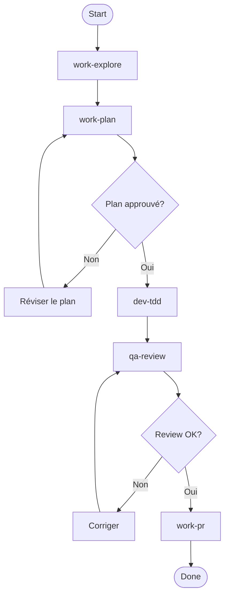
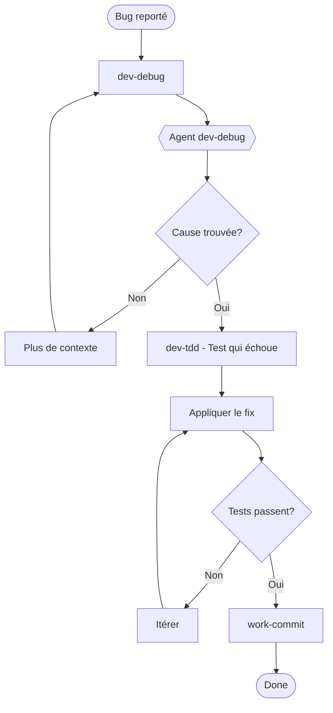
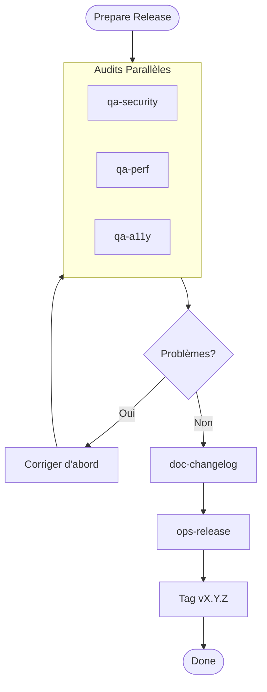
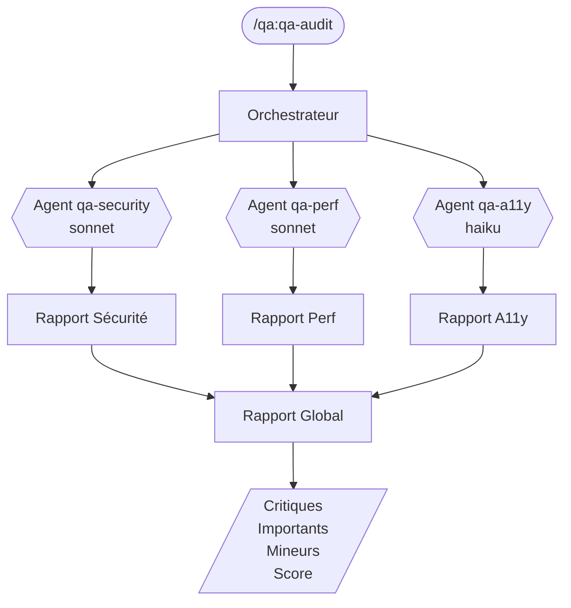
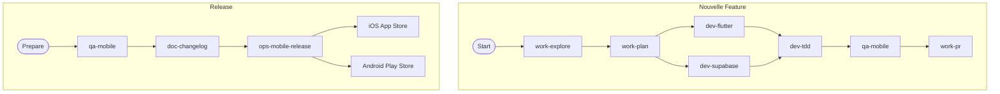
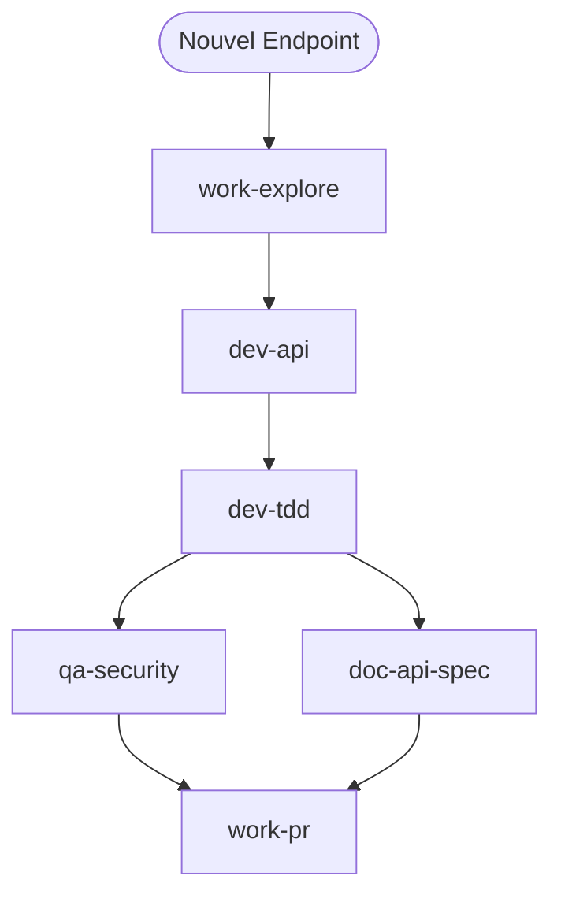
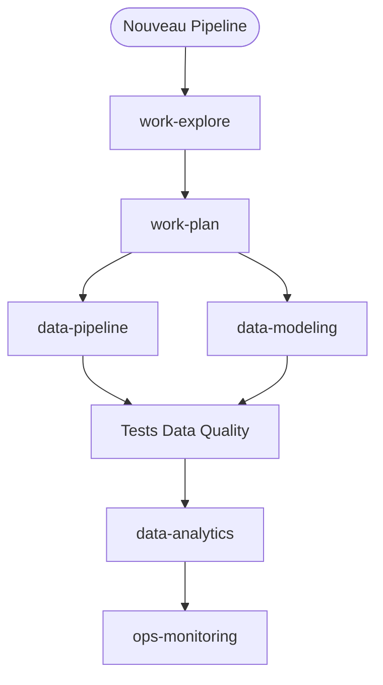

# Workflows Visuels

> Diagrammes des flux de travail recommandes

## Workflow Principal: Explore → Plan → Code → Commit

```
┌─────────────────────────────────────────────────────────────────────┐
│                                                                     │
│   ┌──────────┐    ┌──────────┐    ┌──────────┐    ┌──────────┐     │
│   │          │    │          │    │          │    │          │     │
│   │ EXPLORE  │───▶│   PLAN   │───▶│   CODE   │───▶│  COMMIT  │     │
│   │          │    │          │    │          │    │          │     │
│   └──────────┘    └──────────┘    └──────────┘    └──────────┘     │
│        │               │               │               │            │
│        ▼               ▼               ▼               ▼            │
│   /work:work-explore   /work:work-plan      /dev:dev-tdd       /work:work-commit      │
│                                   /dev:dev-api       /work:work-pr          │
│                                   /dev:dev-component                   │
│                                                                     │
└─────────────────────────────────────────────────────────────────────┘
```

### Mermaid
```mermaid
flowchart LR
    A[EXPLORE] --> B[PLAN]
    B --> C[CODE]
    C --> D[COMMIT]

    A --> A1[/work:work-explore]
    B --> B1[/work:work-plan]
    C --> C1[/dev:dev-tdd]
    C --> C2[/dev:dev-api]
    C --> C3[/dev:dev-component]
    D --> D1[/work:work-commit]
    D --> D2[/work:work-pr]
```

## Workflow Feature Complete

```
┌─────────────────────────────────────────────────────────────────────────────┐
│                           /work:work-flow-feature                                 │
│                                                                             │
│  ┌───────────────────────────────────────────────────────────────────────┐  │
│  │                                                                       │  │
│  │   START                                                               │  │
│  │     │                                                                 │  │
│  │     ▼                                                                 │  │
│  │   ┌─────────────┐                                                     │  │
│  │   │ work-explore│ ─────────────────────────────────┐                  │  │
│  │   └──────┬──────┘                                  │                  │  │
│  │          │                                         │                  │  │
│  │          ▼                                         ▼                  │  │
│  │   ┌─────────────┐                          ┌─────────────┐            │  │
│  │   │  work-plan  │                          │   RULES     │            │  │
│  │   └──────┬──────┘                          │ (typescript,│            │  │
│  │          │                                 │  react,     │            │  │
│  │          │ Plan approuve?                  │  security)  │            │  │
│  │          │                                 └─────────────┘            │  │
│  │     ┌────┴────┐                                                       │  │
│  │     │         │                                                       │  │
│  │    Non       Oui                                                      │  │
│  │     │         │                                                       │  │
│  │     ▼         ▼                                                       │  │
│  │   Reviser  ┌──────────────┐                                           │  │
│  │   le plan  │   dev-tdd    │                                           │  │
│  │            └──────┬───────┘                                           │  │
│  │                   │                                                   │  │
│  │                   ▼                                                   │  │
│  │            ┌──────────────┐                                           │  │
│  │            │  qa-review   │                                           │  │
│  │            └──────┬───────┘                                           │  │
│  │                   │                                                   │  │
│  │                   │ Review OK?                                        │  │
│  │              ┌────┴────┐                                              │  │
│  │              │         │                                              │  │
│  │             Non       Oui                                             │  │
│  │              │         │                                              │  │
│  │              ▼         ▼                                              │  │
│  │           Corriger  ┌──────────────┐                                  │  │
│  │                     │   work-pr    │                                  │  │
│  │                     └──────┬───────┘                                  │  │
│  │                            │                                          │  │
│  │                            ▼                                          │  │
│  │                          DONE                                         │  │
│  │                                                                       │  │
│  └───────────────────────────────────────────────────────────────────────┘  │
│                                                                             │
└─────────────────────────────────────────────────────────────────────────────┘
```

### Mermaid


## Workflow Bugfix

```
┌─────────────────────────────────────────────────────────────────────────────┐
│                           /work:work-flow-bugfix                                  │
│                                                                             │
│  ┌───────────────────────────────────────────────────────────────────────┐  │
│  │                                                                       │  │
│  │   BUG REPORTE                                                         │  │
│  │        │                                                              │  │
│  │        ▼                                                              │  │
│  │   ┌─────────────┐                                                     │  │
│  │   │  dev-debug  │────────┐                                            │  │
│  │   └──────┬──────┘        │                                            │  │
│  │          │               ▼                                            │  │
│  │          │        ┌─────────────┐                                     │  │
│  │          │        │   AGENT     │                                     │  │
│  │          │        │  dev-debug  │                                     │  │
│  │          │        │  (isolé)    │                                     │  │
│  │          │        └──────┬──────┘                                     │  │
│  │          │               │                                            │  │
│  │          │◀──────────────┘                                            │  │
│  │          │                                                            │  │
│  │          │ Cause identifiée?                                          │  │
│  │     ┌────┴────┐                                                       │  │
│  │     │         │                                                       │  │
│  │    Non       Oui                                                      │  │
│  │     │         │                                                       │  │
│  │     ▼         ▼                                                       │  │
│  │  Plus de   ┌──────────────┐                                           │  │
│  │  contexte  │ dev-tdd      │ (test qui échoue)                         │  │
│  │            └──────┬───────┘                                           │  │
│  │                   │                                                   │  │
│  │                   ▼                                                   │  │
│  │            ┌──────────────┐                                           │  │
│  │            │    FIX       │                                           │  │
│  │            └──────┬───────┘                                           │  │
│  │                   │                                                   │  │
│  │                   ▼                                                   │  │
│  │            ┌──────────────┐                                           │  │
│  │            │  Tests pass? │                                           │  │
│  │            └──────┬───────┘                                           │  │
│  │              ┌────┴────┐                                              │  │
│  │             Non       Oui                                             │  │
│  │              │         │                                              │  │
│  │              ▼         ▼                                              │  │
│  │           Itérer   ┌──────────────┐                                   │  │
│  │                    │ work-commit  │                                   │  │
│  │                    └──────────────┘                                   │  │
│  │                                                                       │  │
│  └───────────────────────────────────────────────────────────────────────┘  │
│                                                                             │
└─────────────────────────────────────────────────────────────────────────────┘
```

### Mermaid


## Workflow Release

```
┌─────────────────────────────────────────────────────────────────────────────┐
│                           /work:work-flow-release                                 │
│                                                                             │
│  ┌───────────────────────────────────────────────────────────────────────┐  │
│  │                                                                       │  │
│  │   PREPARE RELEASE                                                     │  │
│  │        │                                                              │  │
│  │        ▼                                                              │  │
│  │   ┌──────────────────────────────────────────────┐                    │  │
│  │   │              AUDITS PARALLELES                │                   │  │
│  │   │                                               │                   │  │
│  │   │  ┌─────────┐  ┌─────────┐  ┌─────────┐       │                   │  │
│  │   │  │qa-security│  qa-perf │  qa-a11y │        │                   │  │
│  │   │  │  AGENT  │  │ AGENT   │  │ AGENT  │        │                   │  │
│  │   │  └────┬────┘  └────┬────┘  └───┬────┘        │                   │  │
│  │   │       │            │           │              │                   │  │
│  │   │       └────────────┼───────────┘              │                   │  │
│  │   │                    │                          │                   │  │
│  │   └────────────────────┼──────────────────────────┘                   │  │
│  │                        │                                              │  │
│  │                        ▼                                              │  │
│  │                 ┌─────────────┐                                       │  │
│  │                 │ Problèmes?  │                                       │  │
│  │                 └──────┬──────┘                                       │  │
│  │                   ┌────┴────┐                                         │  │
│  │                  Oui       Non                                        │  │
│  │                   │         │                                         │  │
│  │                   ▼         ▼                                         │  │
│  │               Corriger  ┌─────────────┐                               │  │
│  │               d'abord   │doc-changelog│                               │  │
│  │                         └──────┬──────┘                               │  │
│  │                                │                                      │  │
│  │                                ▼                                      │  │
│  │                         ┌─────────────┐                               │  │
│  │                         │ ops-release │                               │  │
│  │                         └──────┬──────┘                               │  │
│  │                                │                                      │  │
│  │                                ▼                                      │  │
│  │                         ┌─────────────┐                               │  │
│  │                         │    TAG      │                               │  │
│  │                         │  vX.Y.Z     │                               │  │
│  │                         └─────────────┘                               │  │
│  │                                                                       │  │
│  └───────────────────────────────────────────────────────────────────────┘  │
│                                                                             │
└─────────────────────────────────────────────────────────────────────────────┘
```

### Mermaid


## Workflow Audit Complet

```
┌─────────────────────────────────────────────────────────────────────────────┐
│                              /qa:qa-audit                                       │
│                                                                             │
│  ┌───────────────────────────────────────────────────────────────────────┐  │
│  │                                                                       │  │
│  │                    ORCHESTRATEUR PRINCIPAL                            │  │
│  │                           │                                           │  │
│  │       ┌───────────────────┼───────────────────┐                       │  │
│  │       │                   │                   │                       │  │
│  │       ▼                   ▼                   ▼                       │  │
│  │  ┌─────────┐        ┌─────────┐         ┌─────────┐                   │  │
│  │  │ AGENT   │        │ AGENT   │         │ AGENT   │                   │  │
│  │  │qa-security│       qa-perf │         │qa-a11y  │                   │  │
│  │  │(sonnet) │        │(sonnet) │         │(haiku)  │                   │  │
│  │  └────┬────┘        └────┬────┘         └────┬────┘                   │  │
│  │       │                  │                   │                        │  │
│  │       │                  │                   │                        │  │
│  │       ▼                  ▼                   ▼                        │  │
│  │  ┌─────────┐        ┌─────────┐         ┌─────────┐                   │  │
│  │  │ Rapport │        │ Rapport │         │ Rapport │                   │  │
│  │  │Sécurité │        │  Perf   │         │  A11y   │                   │  │
│  │  └────┬────┘        └────┬────┘         └────┬────┘                   │  │
│  │       │                  │                   │                        │  │
│  │       └──────────────────┼───────────────────┘                        │  │
│  │                          │                                            │  │
│  │                          ▼                                            │  │
│  │                   ┌─────────────┐                                     │  │
│  │                   │   RAPPORT   │                                     │  │
│  │                   │   GLOBAL    │                                     │  │
│  │                   │             │                                     │  │
│  │                   │ - Critiques │                                     │  │
│  │                   │ - Importants│                                     │  │
│  │                   │ - Mineurs   │                                     │  │
│  │                   │ - Score     │                                     │  │
│  │                   └─────────────┘                                     │  │
│  │                                                                       │  │
│  └───────────────────────────────────────────────────────────────────────┘  │
│                                                                             │
└─────────────────────────────────────────────────────────────────────────────┘
```

### Mermaid


## Workflow Mobile Flutter

```
┌─────────────────────────────────────────────────────────────────────────────┐
│                     Workflow App Mobile Flutter                              │
│                                                                             │
│  ┌───────────────────────────────────────────────────────────────────────┐  │
│  │                                                                       │  │
│  │   NOUVELLE FEATURE                                                    │  │
│  │        │                                                              │  │
│  │        ▼                                                              │  │
│  │   ┌─────────────┐                                                     │  │
│  │   │work-explore │                                                     │  │
│  │   └──────┬──────┘                                                     │  │
│  │          │                                                            │  │
│  │          ▼                                                            │  │
│  │   ┌─────────────┐                                                     │  │
│  │   │ work-plan   │  Clean Architecture                                 │  │
│  │   │             │  - Domain (entities, usecases)                      │  │
│  │   │             │  - Data (models, repos impl)                        │  │
│  │   │             │  - Presentation (BLoC, pages)                       │  │
│  │   └──────┬──────┘                                                     │  │
│  │          │                                                            │  │
│  │    ┌─────┴─────┐                                                      │  │
│  │    │           │                                                      │  │
│  │    ▼           ▼                                                      │  │
│  │  ┌───────┐  ┌───────┐                                                 │  │
│  │  │dev-   │  │dev-   │                                                 │  │
│  │  │flutter│  │supabase│ (si backend)                                   │  │
│  │  └───┬───┘  └───┬───┘                                                 │  │
│  │      │          │                                                     │  │
│  │      └────┬─────┘                                                     │  │
│  │           │                                                           │  │
│  │           ▼                                                           │  │
│  │    ┌─────────────┐                                                    │  │
│  │    │   dev-tdd   │  Tests unitaires & widget                          │  │
│  │    └──────┬──────┘                                                    │  │
│  │           │                                                           │  │
│  │           ▼                                                           │  │
│  │    ┌─────────────┐                                                    │  │
│  │    │  qa-mobile  │  Audit complet mobile                              │  │
│  │    └──────┬──────┘                                                    │  │
│  │           │                                                           │  │
│  │           ▼                                                           │  │
│  │    ┌─────────────┐                                                    │  │
│  │    │  work-pr    │                                                    │  │
│  │    └─────────────┘                                                    │  │
│  │                                                                       │  │
│  └───────────────────────────────────────────────────────────────────────┘  │
│                                                                             │
│                                                                             │
│  ┌───────────────────────────────────────────────────────────────────────┐  │
│  │   RELEASE                                                             │  │
│  │        │                                                              │  │
│  │        ▼                                                              │  │
│  │   ┌─────────────┐                                                     │  │
│  │   │  qa-mobile  │  Pre-release checks                                 │  │
│  │   └──────┬──────┘                                                     │  │
│  │          │                                                            │  │
│  │          ▼                                                            │  │
│  │   ┌─────────────┐                                                     │  │
│  │   │doc-changelog│                                                     │  │
│  │   └──────┬──────┘                                                     │  │
│  │          │                                                            │  │
│  │          ▼                                                            │  │
│  │   ┌─────────────┐                                                     │  │
│  │   │ops-mobile-  │  Fastlane iOS + Android                             │  │
│  │   │   release   │                                                     │  │
│  │   └──────┬──────┘                                                     │  │
│  │          │                                                            │  │
│  │    ┌─────┴─────┐                                                      │  │
│  │    │           │                                                      │  │
│  │    ▼           ▼                                                      │  │
│  │  ┌───────┐  ┌───────┐                                                 │  │
│  │  │  iOS  │  │Android│                                                 │  │
│  │  │ Store │  │ Play  │                                                 │  │
│  │  └───────┘  └───────┘                                                 │  │
│  │                                                                       │  │
│  └───────────────────────────────────────────────────────────────────────┘  │
│                                                                             │
└─────────────────────────────────────────────────────────────────────────────┘
```

### Mermaid


## Workflow API Backend

```
┌─────────────────────────────────────────────────────────────────────────────┐
│                        Workflow API Backend                                  │
│                                                                             │
│  ┌───────────────────────────────────────────────────────────────────────┐  │
│  │                                                                       │  │
│  │   NOUVEL ENDPOINT                                                     │  │
│  │        │                                                              │  │
│  │        ▼                                                              │  │
│  │   ┌─────────────┐                                                     │  │
│  │   │work-explore │ Comprendre l'API existante                          │  │
│  │   └──────┬──────┘                                                     │  │
│  │          │                                                            │  │
│  │          ▼                                                            │  │
│  │   ┌─────────────┐                                                     │  │
│  │   │   dev-api   │ Routes, Controllers, Services                       │  │
│  │   └──────┬──────┘                                                     │  │
│  │          │                                                            │  │
│  │          ▼                                                            │  │
│  │   ┌─────────────┐                                                     │  │
│  │   │   dev-tdd   │ Tests d'intégration API                             │  │
│  │   └──────┬──────┘                                                     │  │
│  │          │                                                            │  │
│  │    ┌─────┴─────┐                                                      │  │
│  │    │           │                                                      │  │
│  │    ▼           ▼                                                      │  │
│  │  ┌───────┐  ┌────────────┐                                            │  │
│  │  │qa-    │  │doc-api-spec│                                            │  │
│  │  │security│  │ (OpenAPI)  │                                            │  │
│  │  └───┬───┘  └─────┬──────┘                                            │  │
│  │      │            │                                                   │  │
│  │      └─────┬──────┘                                                   │  │
│  │            │                                                          │  │
│  │            ▼                                                          │  │
│  │     ┌─────────────┐                                                   │  │
│  │     │   work-pr   │                                                   │  │
│  │     └─────────────┘                                                   │  │
│  │                                                                       │  │
│  └───────────────────────────────────────────────────────────────────────┘  │
│                                                                             │
└─────────────────────────────────────────────────────────────────────────────┘
```

### Mermaid


## Workflow Data Pipeline

```
┌─────────────────────────────────────────────────────────────────────────────┐
│                       Workflow Data Pipeline                                 │
│                                                                             │
│  ┌───────────────────────────────────────────────────────────────────────┐  │
│  │                                                                       │  │
│  │   NOUVEAU PIPELINE                                                    │  │
│  │        │                                                              │  │
│  │        ▼                                                              │  │
│  │   ┌─────────────┐                                                     │  │
│  │   │work-explore │ Sources, schémas existants                          │  │
│  │   └──────┬──────┘                                                     │  │
│  │          │                                                            │  │
│  │          ▼                                                            │  │
│  │   ┌─────────────┐                                                     │  │
│  │   │ work-plan   │ Architecture ETL/ELT                                │  │
│  │   └──────┬──────┘                                                     │  │
│  │          │                                                            │  │
│  │    ┌─────┴─────┐                                                      │  │
│  │    │           │                                                      │  │
│  │    ▼           ▼                                                      │  │
│  │  ┌────────┐  ┌────────────┐                                           │  │
│  │  │ data-  │  │   data-    │                                           │  │
│  │  │pipeline│  │  modeling  │                                           │  │
│  │  │(Airflow)│  │   (dbt)   │                                           │  │
│  │  └────┬───┘  └─────┬──────┘                                           │  │
│  │       │            │                                                  │  │
│  │       └─────┬──────┘                                                  │  │
│  │             │                                                         │  │
│  │             ▼                                                         │  │
│  │      ┌─────────────┐                                                  │  │
│  │      │    Tests    │ Data quality checks                              │  │
│  │      │ (Great Exp) │                                                  │  │
│  │      └──────┬──────┘                                                  │  │
│  │             │                                                         │  │
│  │             ▼                                                         │  │
│  │      ┌─────────────┐                                                  │  │
│  │      │   data-     │ Dashboards, KPIs                                 │  │
│  │      │  analytics  │                                                  │  │
│  │      └──────┬──────┘                                                  │  │
│  │             │                                                         │  │
│  │             ▼                                                         │  │
│  │      ┌─────────────┐                                                  │  │
│  │      │    ops-     │ Monitoring pipelines                             │  │
│  │      │ monitoring  │                                                  │  │
│  │      └─────────────┘                                                  │  │
│  │                                                                       │  │
│  └───────────────────────────────────────────────────────────────────────┘  │
│                                                                             │
└─────────────────────────────────────────────────────────────────────────────┘
```

### Mermaid


## Légende des Diagrammes

```
┌─────────────────────────────────────────────────────────────────┐
│                         LÉGENDE                                 │
├─────────────────────────────────────────────────────────────────┤
│                                                                 │
│   ┌──────────┐                                                  │
│   │          │    Commande (manuel)                             │
│   └──────────┘                                                  │
│                                                                 │
│   ┌──────────┐                                                  │
│   │  AGENT   │    Agent (contexte isolé)                        │
│   │ (model)  │                                                  │
│   └──────────┘                                                  │
│                                                                 │
│   ┌──────────┐                                                  │
│   │   ◇◇◇    │    Decision point                                │
│   └──────────┘                                                  │
│                                                                 │
│       │                                                         │
│       ▼           Flux séquentiel                               │
│                                                                 │
│       │                                                         │
│   ────┼────       Flux parallèle                                │
│       │                                                         │
│                                                                 │
│   ─ ─ ─ ─ ─       Optionnel                                     │
│                                                                 │
│   ═════════       Séparateur de section                         │
│                                                                 │
└─────────────────────────────────────────────────────────────────┘
```
